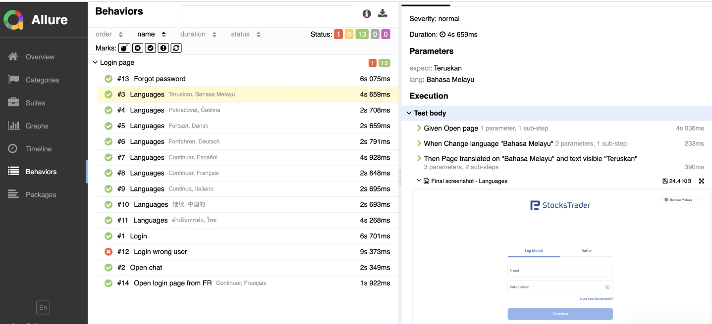

# 🌐 Login Testing Project

Проект автоматизированного тестирования страницы логина с использованием **Playwright**, **pytest** и **BDD (Gherkin)**.

---

## 🧩 Стек технологий

- Python
- [Playwright](https://playwright.dev/python/)
- [pytest](https://docs.pytest.org/)
- [pytest-bdd](https://github.com/pytest-dev/pytest-bdd)
- Allure (для генерации отчётов)
- Gherkin (описание сценариев)
- Page Object Pattern
- Скриншоты при ошибках и успешных регистрациях
- Визуальное тестирование (https://pypi.org/project/pytest-playwright-visual/)

---

## Команды

```bash
	make install    — Установить зависимости и браузеры Playwright
	make test       — Запустить автотесты
	make test_only  — Запустить автотесты только один автотест с меткой only
	make clean      — Очистить allure-результаты и отчёты
	make allure     — Сгенерировать HTML-отчёт из результатов
	make serve      — Запустить локальный сервер для просмотра allure-отчёта
	make linter     — Запустить проверку кода ```


